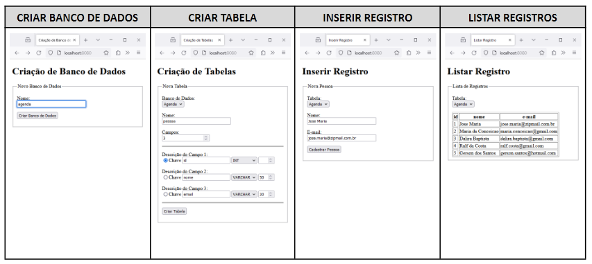

# Lasalle Sistemas Distribuídos

## Como usar

1. Inicie o seu mysql ou use via docker: `docker compose up -d`
2. Verifique se as credenciais de conexào estão ok em [main.js](src/main.js)
3. Instale os pacotes do Node: `npm install`
4. Rode o servidor: `npm run start`

## Trabalho

**COMPETÊNCIA A SER DESENVOLVIDA:** construir aplicações em Node.js manipulando banco de dados MySQL.
**PERÍODO DE ENTREGA:** até 30 de abril de 2024.
**FORMA DE ENTREGA:** realizar o download deste arquivo na sala de aula do Google Classroom, colocar o nome e a matrícula dos componentes do grupo, salvar esse arquivo em PDF e adicionar esse arquivo a aplicação Node.js em uma pasta compactada (formato ZIP, pelo amor de Deus não enviar em formato RAR e nenhum outro formato) a atividade “Trabalho de 1ª Avaliação” na sala de aula do Google Classroom e marcar a atividade como entregue.
OBSERVAÇÃO: não serão aceitos trabalhos após a data de entrega, grupos com mais de 3 alunos e grupos com
aplicações iguais.

Construir uma aplicação Node.js para simular uma ferramenta administrativa de banco de dados MySQL. Esta
ferramenta deve permitir:

- Criar bancos de dados
- Criar tabelas em um banco de dados
- Inserir registros em uma tabela
- Listar os registros de uma tabela

Exemplos:

PDF: [Requisitos AV1](docs/lasalle/requirements-av1.pdf)
